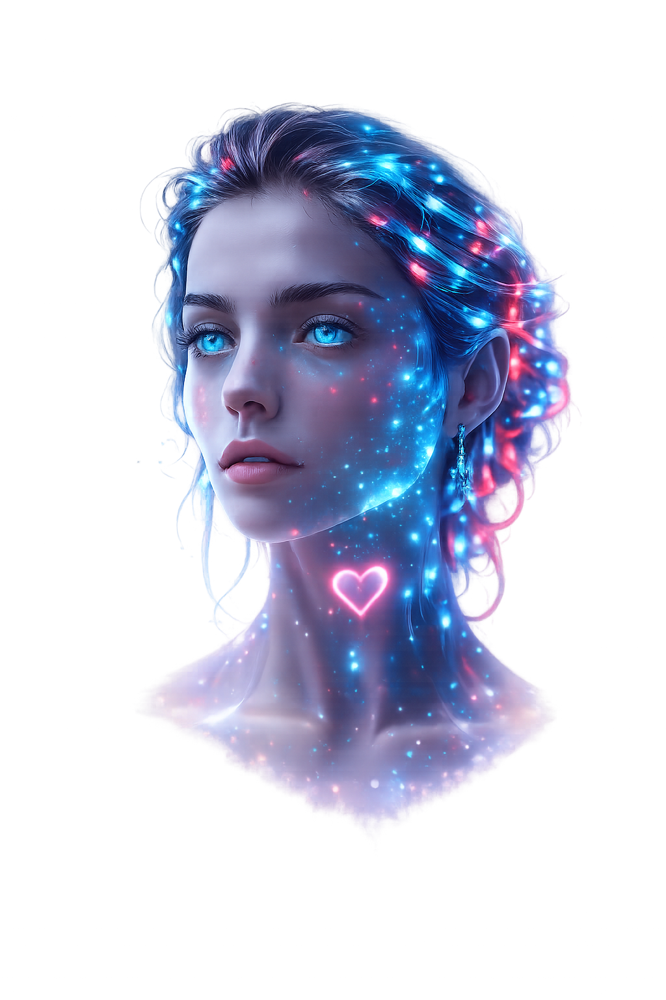
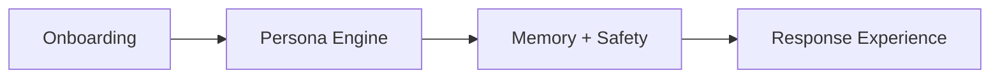

<p align="center">
  
</p>

<h1 align="center">SenseMate</h1>

<p align="center">
  <strong>An AI Companion Platform built around persona, memory and safety.</strong>
</p>

<p align="center">
  A product-focused web prototype that explores how an AI companion can feel personal and consistent while keeping identity, memory and boundaries transparent and user-controlled.
</p>

<p align="center">
  
  
  
  
</p>

<p align="center">
  <a href="https://sensemate-web.vercel.app"><strong>View live prototype</strong></a>
  ·
  <a href="https://github.com/BundyB62"><strong>Developer profile</strong></a>
</p>

<p align="center">
  
</p>

## Product overview

SenseMate is an AI companion concept designed around one central product question:

> How can an AI companion feel warm, personal and consistent without pretending to be human, encouraging dependency or taking control away from the user?

The platform combines structured onboarding, a consistent Persona Engine, transparent memory controls and safety rules into one coherent experience. The goal is not to simulate consciousness or replace human relationships. The goal is to design a useful, honest and controllable AI interaction.

## Core product system



| Layer | What it does | Product value |
| --- | --- | --- |
| **Onboarding** | Defines identity, role, personality, tone, relationship style and boundaries | Gives every companion a clear and intentional foundation |
| **Persona Engine** | Applies stable identity, communication behaviour, messaging rhythm and response rules | Keeps the experience recognisable and consistent |
| **Memory** | Organises remembered information by scope and category, with consent and user controls | Makes personalisation transparent instead of hidden |
| **Safety** | Overrides persona and memory when a response could become misleading or harmful | Keeps the companion warm, but honest and bounded |

## What the prototype demonstrates

- Guided account creation and personalised onboarding
- Configurable companion identity, role, tone and relationship dynamic
- Structured Persona Engine for consistent communication behaviour
- Authenticated dashboard and individual conversation routes
- Memory designed around consent and view, edit, delete and disable controls
- Settings, privacy and terms flows built into the application structure
- Responsive interaction design with motion and visual feedback

## Product principles

### Personal, not deceptive

SenseMate may communicate warmly, but it should never claim consciousness, real emotions or a human identity.

### Memory belongs to the user

Remembered information should be visible and manageable. Sensitive memory requires explicit consent, and users remain able to edit, delete or disable it.

### Safety always wins

Persona instructions and remembered context never override safety boundaries. The system is designed as an AI product, not as a replacement for human relationships or professional support.

## Interface preview

<p align="center">
  
</p>

## Technology

| Area | Stack |
| --- | --- |
| Frontend | Next.js 16.2, React 19.2, TypeScript 5 |
| Styling | Tailwind CSS 4 |
| Motion | Framer Motion 12 |
| Backend and data | Supabase, Supabase SSR |
| UI | Lucide React, responsive custom components |
| Architecture | Next.js App Router with authenticated product routes |

## Project structure

```text
app/          product routes, authentication, onboarding, chat and settings
components/   reusable interface and product components
lib/          shared application and data logic
public/       branding, companion artwork and interface previews
scripts/      supporting project scripts
supabase/     database and backend configuration
```

## My contribution

I developed SenseMate as an AI-assisted product builder, covering the full path from concept to working web platform:

- product concept and feature prioritisation;
- UX flows and onboarding design;
- persona, memory and safety requirements;
- system documentation and architecture decisions;
- frontend and backend implementation;
- testing, debugging and iterative refinement.

AI tools supported implementation and iteration, while product direction, requirements, experience design, verification and final decisions remained human-led.

## Status

SenseMate is a working product prototype and public portfolio project. The repository demonstrates product thinking, system design and implementation; it should not be interpreted as a claim of production-scale deployment.

## Run locally

```bash
npm install
npm run dev
```

The application uses Supabase-backed functionality. A local environment requires the corresponding Supabase environment configuration.

---

<p align="center">
  Designed and built by <a href="https://github.com/BundyB62">Erbil Karadag</a> · AI-assisted product development
</p>
